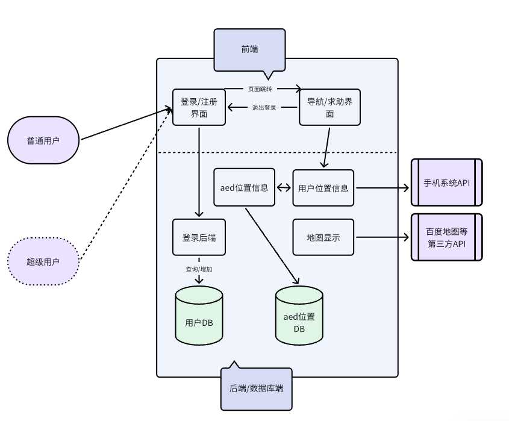

# AED-Finder

## 初步功能：
1. 可获取用户的地理位置并实时更新
    - 可能会需要完成的功能：获取用户地理位置，实时更新地图上的位置
2. 标注地图上附近的aed设施位置
    - 可能会需要完成的功能：aed设备位置的增删查改（增删改可能涉及管理员权限，至少需要完成基本的查）
    - 可能会需要完成的功能：获取aed设备位置，标注在地图上
3. 实现地图上实时位置到每一个aed设备的导航功能
    - 可能会需要完成的功能：根据用户位置信息和aed设备位置位置信息，调用第三方API完成导航
## 进阶功能：（不优先实现）
1. 用户登录功能（数据库）
    - 可能会需要完成的功能：用户信息的增删查改，用户权限的修改（如果有管理员的话）
2. 紧急求助发送功能，附近区域的用户会接受到信息
    - 可能涉及的功能：用户选择共享或者 不共享自己的位置，用户选择发送紧急求助信息，用户选择取消紧急求助信息，用户选择查看附近的紧急求助信息，用户选择查看自己发送的紧急求助信息

## 产品系统架构图
