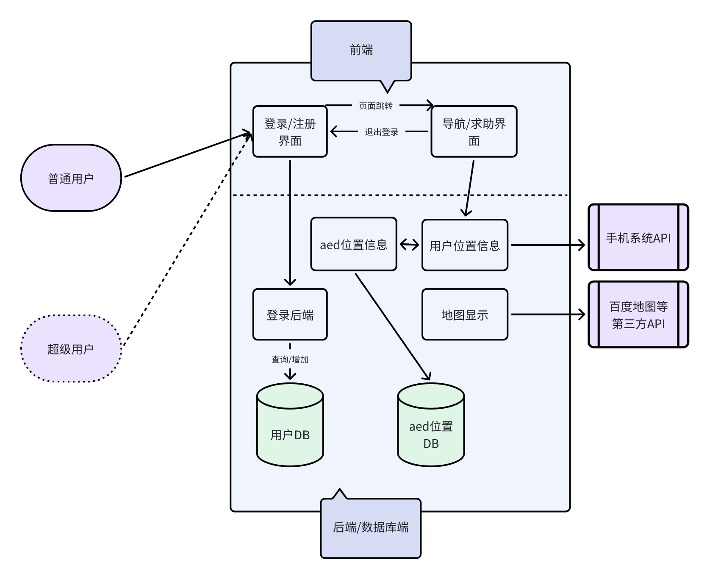

# AED-Finder
## 项目内容：
### 软件名：AED-Finder  （目前预想实现大学城）
### 概述
Aed是一种急救装备，在发生意外时能够快速进行急救，本项目旨在通过地图定位的方式，帮助用户找到附近的aed设备，并实现一键导航功能。
### 初步功能
1、可获取用户的地理位置并实时更新，标注地图上附近的aed设施位置，每一个可实现导航功能
2、能够一键导航到离用户最近的aed设备
### 进阶功能
1、用户登录功能（数据库）
紧急求助发送功能，附近区域的用户会接受到信息

## 技术栈
1. 前端：React
2. 后端：spring boot, Maven, mybatis(mysql)

## 项目结构
