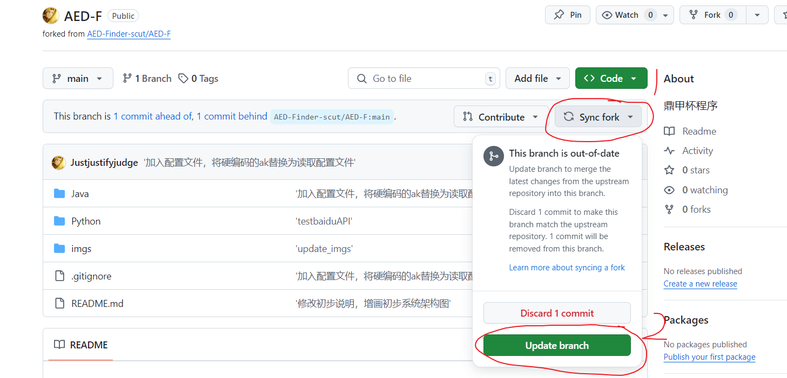
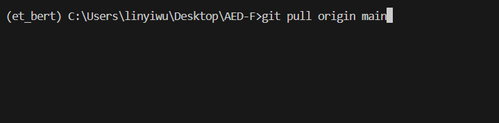
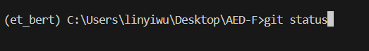
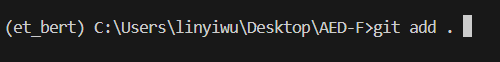
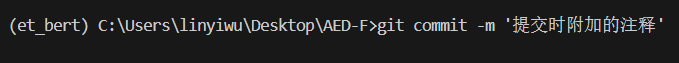
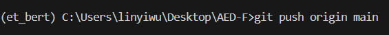
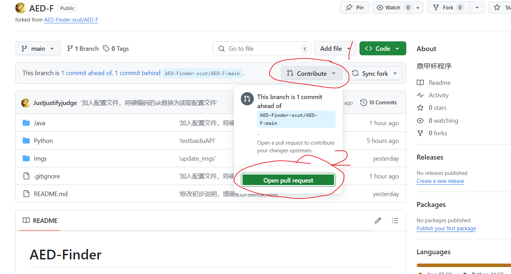
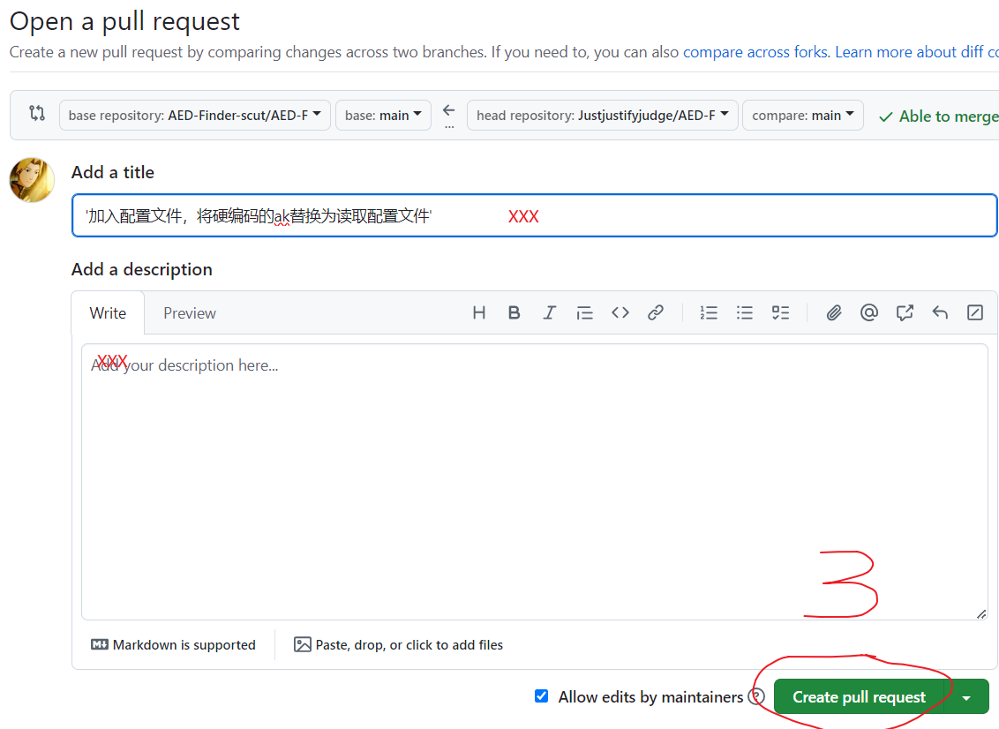

# 基本命令
## 可以参考以下执行顺序

- 0.在sync fork处获取主仓库的更新（在github上操作）

- 1.首先获取远程仓库的修改内容（本地cmd/git bash）

使用git pull <远程仓库的地址> <本地仓库的分支名（默认是origin或者main）>

### 接下来是你对代码进行修改
#
### 修改完成后

- 2.查看本地仓库发生的更改（本地cmd/git bash）

使用git status命令

- 3.选择要提交的内容（本地cmd/git bash）

使用git add <文件名>命令，使用该命令后会将更改添加到队列中

默认一般使用git add .命令，会上传所有的更改

- 4.提交更改（本地cmd/git bash）

使用git commit -m "注释" 来提交更改，之后本地仓库存放的内容就保存为更改之后的内容

- 5.将更改提交到远程（本地cmd/git bash）

使用git push <远程仓库的地址> <本地仓库的分支名（默认是origin或者main）> 来将内容提交到GitHub之类的远程仓库

- last.将自己的远程仓库同步到所有人的远程仓库。（在github上操作）

在contribute处选择open pull request，检查各个文件的更改，提交更改。

